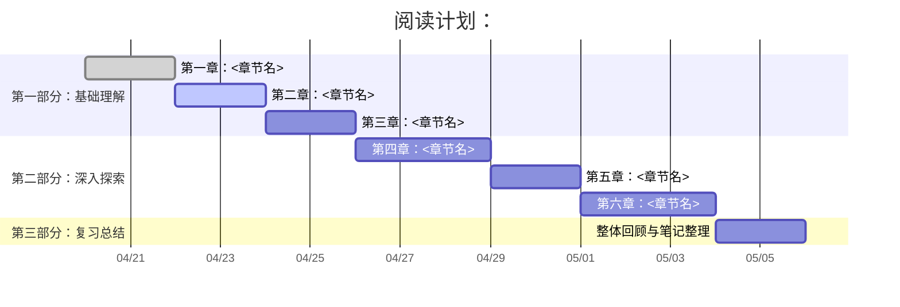

# 《BookName》学习笔记

## 📝 内容概览
[简要介绍本书内容、难度、适合人群]
## 📝 阅读计划

## 📋 章节目录
- [[01-章节名称]] - 章节简述
- [[02-章节名称]] - 章节简述

## 🔍 重点内容索引
- [[notes/概念A]]
- [[notes/概念B]]

## 📚 参考资源
- 官方网站：[链接](URL)
- 配套代码：[[.CodeReference/README]]

## 📝 书写规范
详细的书写规范请参考：[[WritingStandards]]
