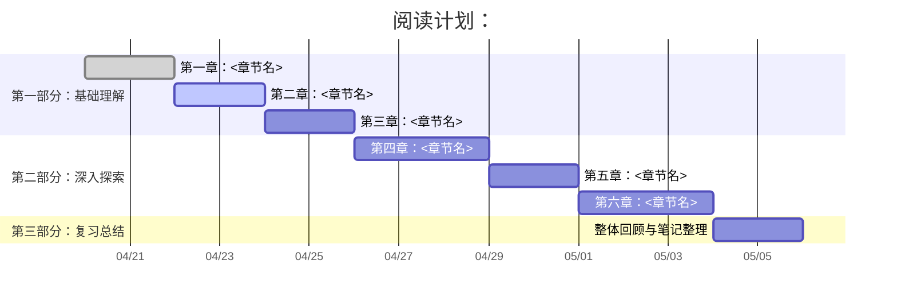

# 《BookName》学习笔记

## 📝 内容概览
[简要介绍本书内容、难度、适合人群]

## 🔢 321学习法应用
- **3个输入源**：📚书籍(BookReference) + 🎥长内容(系统课程) + 📲短内容(碎片资讯)
- **2种输出方式**：✍️写下来(经验沉淀) + 🗣️说出来(费曼教学)  
- **1次周期复盘**：📊2个月深度复盘，决策继续深耕or换方向

## 📝 阅读计划

```mermaid
gantt
    title 阅读计划：<BookName>
    dateFormat  YYYY-MM-DD
    axisFormat  %m/%d

    section 第一部分：基础理解
    第一章：<章节名>       :done,    ch1, 2025-04-20, 2d
    第二章：<章节名>       :active,  ch2, after ch1, 2d
    第三章：<章节名>       :         ch3, after ch2, 2d

    section 第二部分：深入探索
    第四章：<章节名>       :         ch4, after ch3, 3d
    第五章：<章节名>       :         ch5, after ch4, 2d
    第六章：<章节名>       :         ch6, after ch5, 3d

    section 第三部分：复习总结
    整体回顾与笔记整理     :         review, after ch6, 2d
```

## 📋 章节目录
- [[01-章节名称]] - 章节简述
- [[02-章节名称]] - 章节简述

## 🔍 重点内容索引
- [[notes/概念A]]
- [[notes/概念B]]

## 📤 学习输出记录
### ✍️ 文字输出
- [[我的总结-第X章]] - 用自己的话重新解释核心概念
- [[知识地图-第X章]] - 概念关系图和知识连接

### 🎤 口述输出  
- [[口述记录-第X章]] - 技术讲解录音和反思

### 📊 学习复盘
- [[学习日志-第X周]] - 每周学习回顾和计划

## 📚 参考资源
- 官方网站：[链接](URL)
- 配套代码：[[.CodeReference/README]]

## 📝 书写规范
详细的书写规范请参考：[[WritingStandards]]
