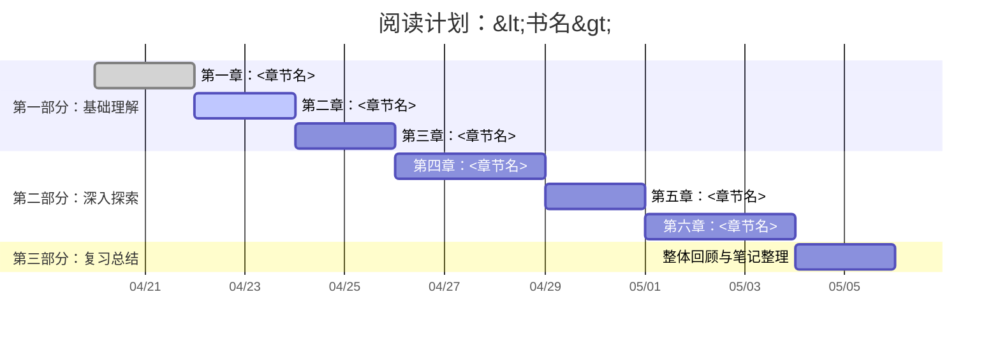

# 📝 技术笔记书写标准规范

## 📁 书籍文件夹规范
- 使用英文书名作为文件夹名称，如 `C++ Primer`
- 每本书独立组织，便于模块化维护
- 复制 `BookName` 文件夹作为模板，重命名为实际书名

## 📑 书籍首页(BookName.md)规范

```markdown
# 《书名》学习笔记

## 📝 内容概览
[简要介绍本书内容、难度、适合人群]

## 📝 阅读计划


## 📋 章节目录
- [[01-章节名称]] - 章节简述
- [[02-章节名称]] - 章节简述

## 🔍 重点内容索引
- [[notes/概念A]]
- [[notes/概念B]]

## 📚 参考资源
- 官方网站：[链接](URL)
- 配套代码：[[.CodeReference/README]]

## 📝 书写规范
详细的书写规范请参考：[[WritingStandards]]
```

## 📖 章节笔记规范
- **文件命名**：`序号-章节名.md`，序号使用两位数字(01, 02...)
- **内容结构**：

```markdown
# 章节名称

## 📌 核心要点
- 要点1
- 要点2

## 📖 详细笔记

### 小节标题
[内容...]

> 💡 **提示**：重要提示或见解

```代码语言
// 示例代码
```

## 🔗 相关概念
- [[notes/相关概念1]]
- [[notes/相关概念2]]

## ✅ 章节练习
[练习题解答或思路]
```

## 📚 碎片索引页(notes/notes.md)规范

```markdown
# 碎片知识索引

## 🧠 核心概念
- [[概念1]] - 简短描述
- [[概念2]] - 简短描述

## 🛠️ 技术实现
- [[技术1]] - 简短描述
- [[技术2]] - 简短描述

## ⚠️ 常见问题与陷阱
- [[问题1]] - 简短描述
- [[问题2]] - 简短描述
```

## 🧩 碎片知识笔记规范
- **文件命名**：使用概念名称，如`右值引用.md`
- **内容结构**：

```markdown
# 概念名称

## 📍 定义
[简洁明了的定义]

## 🔍 详细说明
[详细解释，可包含多个小节]

## 📊 示例
```代码语言
// 代码示例
```

## 🔄 相关概念
- [[其他相关概念1]]
- [[其他相关概念2]]

#标签1 #标签2
```

## 📚 代码与书籍参考规范

### `.CodeReference/` 文件夹
- 包含 README.md 说明代码来源和使用方法
- 可按章节或功能组织子文件夹
- 代码文件添加简要注释

### `.BookReference/` 文件夹
- 存放 PDF 或其他格式电子书
- 添加 README.md 说明版本和获取方式
- 不直接分享侵权内容

## 🏷️ 标签系统规范
- 使用 `#标签名` 格式
- **常用标签类别**：
  - **技术领域**：#C++, #Python, #前端
  - **概念类型**：#算法, #设计模式, #数据结构
  - **难度级别**：#基础, #进阶, #高级
  - **状态标记**：#待完善, #已完成, #重点

## 💡 使用技巧
1. **链接引用**：使用 `[[文件名]]` 创建内部链接
2. **代码高亮**：指定具体语言如 \`\`\`cpp
3. **表格使用**：适合对比概念或总结要点
4. **思维导图**：复杂概念关系可用 Mermaid 图表
5. **定期整理**：及时将零散笔记归类到对应章节
``` 