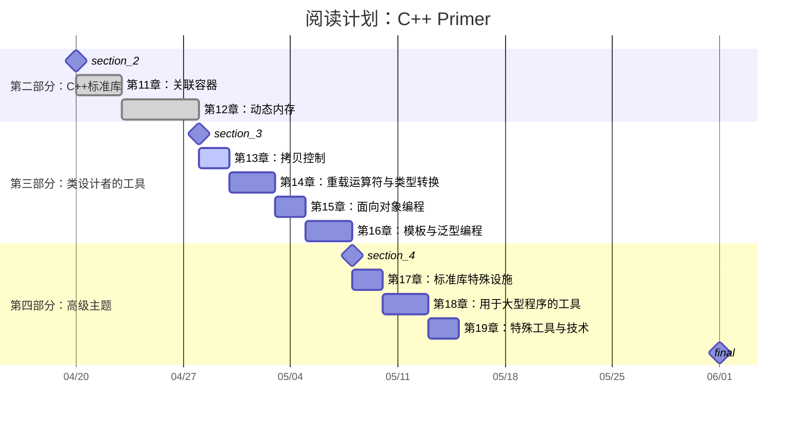

# 《C++ Primer》学习笔记

## 📝 内容概览
《C++ Primer》是C++编程领域的经典教材，全面介绍了C++语言的基础知识与高级特性，适合初学者与有一定编程基础的读者学习。

## 阅读计划

## 📋 章节目录
- [00-序中言](./00-序中言) - C++发展历史与语言特性概述
- [01-开始](./01-开始.md) - C++基础程序结构与编译过程
- [02-变量和基本类型](./02-变量和基本类型.md) - C++基本数据类型与变量声明
- [03-字符串,向量和数组](./03-字符串,向量和数组.md) - C++标准库中的字符串类型与容器
- [04-表达式](./04-表达式.md) - C++表达式与运算符
- [05-语句](./05-语句.md) - C++流程控制语句
- [06-函数](./06-函数.md) - C++函数定义与使用
- [07-类](./07-类.md) - C++面向对象编程基础
- [08-IO库](./08-IO库.md) - C++输入输出流操作
- [09-顺序容器](./09-顺序容器.md) - C++标准库顺序容器详解
- [10-泛型算法](./10-泛型算法.md) - C++标准库算法
- [11-关联容器](./11-关联容器.md) - C++标准库关联容器详解
- [12-动态内存](./12-动态内存.md) - C++动态内存管理
- [13-拷贝控制](./13-拷贝控制.md) - C++拷贝控制与资源管理
- [14-重载运算符与类型转换](./14-重载运算符与类型转换.md) - C++重载运算符与类型转换
- [15-面向对象编程](./15-面向对象编程.md) - C++面向对象编程
- [16-模板与泛型编程](./16-模板与泛型编程.md) - C++模板与泛型编程
- [17-标准库特殊设施](./17-标准库特殊设施.md) - C++标准库特殊设施
- [18-用于大型程序的工具](./18-用于大型程序的工具) - 用于大型程序的工具
- [19-特殊工具与技术](./19-特殊工具与技术.md) - 特殊工具与技术

## 🔍 重点内容索引
- [[notes/index|碎片知识索引]]

## 📚 参考资源
- 官方网站：[C++ Reference](http://www.cplusplus.com/)
- 配套代码：[[.CodeReference/README|代码参考]] 
