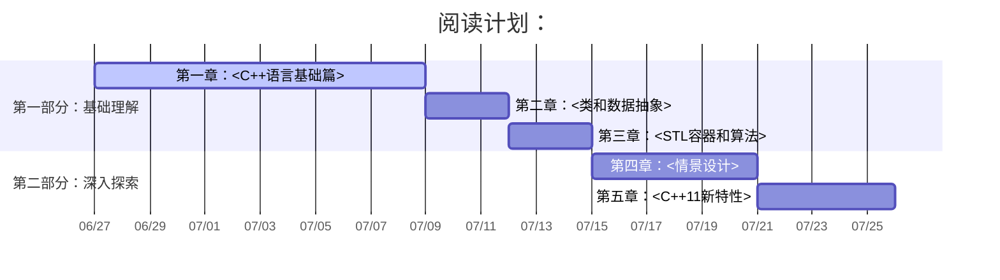

---
jupytext:
  formats: md:markdown,ipynb/BookName/BookName.ipynb:notebook
  text_representation:
    extension: .md
    format_name: markdown
    format_version: '1.3'
    jupytext_version: 1.13.8
kernelspec:
  display_name: C++
  language: C++
  name: xcpp
language_info:
  codemirror_mode: text/x-c++src
  file_extension: .cpp
  mimetype: text/x-c++src
  name: c++
  version: '11'
---

# C++八股文 学习笔记

## 📝 阅读计划

## 📋 章节目录

- [01-C++语言基础篇](01-C++语言基础篇.md) - 章节简述
- [02-类和数据抽象](02-类和数据抽象.md) - 章节简述
- [03-STL容器和算法](03-STL容器和算法.md) - 章节简述
- [04-情景设计](04-情景设计.md) - 章节简述
- [05-C++11新特性](05-C++11新特性.md) - 章节简述

## 📚 参考资源

- 网站：[C++八股文](https://csguide.cn/cpp/intro.html)
- 其他文档: [小贺的C++八股文](.BookReference/亮白风格-C++八股文-小贺-v1.0.pdf)
- 配套代码：[[.CodeReference/README]]
