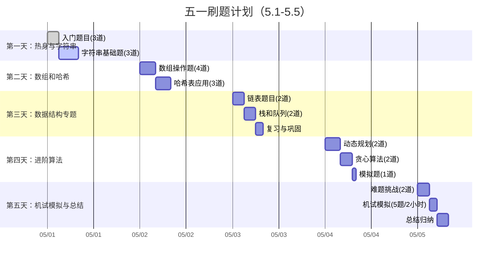

# 华为机试刷题笔记 

## 📝 内容概览
华为机试题是牛客网上的经典算法题集，题目涵盖了字符串处理、数组操作、动态规划等多个知识点。难度从入门到困难不等，适合想要提升算法能力和准备面试的程序员。这些题目很可能在实际机试中原题出现或变形出现，因此针对性地刷题非常重要。
[牛客网华为机试题](https://www.nowcoder.com/exam/oj/ta?tpId=37) 

## 📝 五一假期学习计划

## 📋 高效刷题范式（机试导向）

### 1. 题型分类与识别（必须掌握）
根据华为机试题目的分类统计，按照实际频率分布针对性准备：

- **字符串处理**（约30%）：[字符串处理模板](./notes/string/字符串处理模板.md)
  - 重点题目：HJ1(字符串最后一个单词的长度), HJ4(字符串分隔), HJ5(进制转换), HJ17(坐标移动)
  - 核心技能：分割、查找替换、统计字符频率、字符串转换、正则表达式
  - 常用API：split(), substring(), charAt(), indexOf(), replace(), toLowerCase()/toUpperCase()
  
- **数组操作**（约15%）：[数组操作技巧](./notes/array/数组操作技巧.md)
  - 重点题目：HJ3(明明的随机数), HJ9(提取不重复的整数), HJ58(输出最小的k个)
  - 核心技能：排序、去重、查找、二维数组操作
  - 常用方法：Collections.sort(), Arrays.sort(), Set去重, 自定义比较器

- **哈希表应用**（约10%）：[哈希表应用技巧](./notes/hash/哈希表应用技巧.md)
  - 重点题目：HJ10(字符个数统计), HJ19(简单错误记录), HJ23(删除字符串中出现次数最少的字符)
  - 核心技能：统计频率、查找、去重
  - 实现方式：HashMap, HashSet, TreeMap(有序哈希)

- **排序算法**（约10%）：[排序算法总结](./notes/sort/排序算法总结.md)
  - 重点题目：HJ14(字符串排序), HJ26(字符串排序), HJ101(整型数组排序)
  - 核心技能：基本排序实现、自定义排序规则、部分排序
  - 典型应用：按字典序排序、按频率排序、自定义对象排序

- **简单数据结构**（约8%）：[数据结构实现与应用](./notes/data_structure/数据结构实现与应用.md)
  - 链表（HJ48, HJ51）：创建、遍历、删除节点、找倒数第k个节点
  - 栈（HJ50, HJ70, HJ77）：表达式计算、括号匹配、模拟进出栈
  - 队列：BFS辅助数据结构

- **动态规划**（约5%）：[动态规划五步法](./notes/dynamic_programming/动态规划五步法.md)
  - 重点题目：HJ16(购物单), HJ24(合唱队), HJ32(密码截取), HJ75(公共子串计算)
  - 关键步骤：定义状态、确定转移方程、初始化、计算顺序、结果返回
  - 常见模式：线性DP、区间DP、背包问题

- **基础数学**（约8%）：[数学问题解题技巧](./notes/math/数学问题解题技巧.md)
  - 重点题目：HJ7(取近似值), HJ53(杨辉三角变形), HJ60(查找素数), HJ108(最小公倍数)
  - 核心知识点：进制转换、素数判定、最大公约数/最小公倍数、数学公式应用
  - 数学库：Math类方法、BigInteger/BigDecimal处理大数

- **模拟题**（约9%）：[模拟题解题思路](./notes/simulation/模拟题解题思路.md)
  - 重点题目：HJ21(简单密码), HJ29(字符串加解密), HJ33(IP转换), HJ74(参数解析)
  - 解题思路：理清题意、分解步骤、处理边界情况
  - 技巧：画图、列表格、模拟执行

- **位运算**（约2%）：[位运算技巧](./notes/bit_operation/位运算技巧.md)
  - 重点题目：HJ15(求int中1的个数), HJ62(查找二进制中1的个数), HJ86(求最大连续bit数)
  - 核心操作：与、或、异或、位移、位计数
  - 位运算技巧：n&(n-1)消除最低位的1

- **搜索算法**（约2%）：[搜索算法](./notes/search/搜索算法.md)
  - 重点题目：HJ43(迷宫问题), HJ67(24点游戏算法)
  - DFS：回溯法、递归实现
  - BFS：队列实现、最短路径

- **其他技巧**（约1%）：[其他技巧](./notes/other/其他技巧.md)
  - 贪心算法（HJ45名字的漂亮度）
  - 双指针（HJ51链表倒数第k个节点）
  - 递归（HJ61放苹果, HJ93数组分组, HJ108求最小公倍数）

### 2. 高效刷题流程（单题）
1. **快速理解（5分钟）**
   - 读题找关键词（输入、输出、约束）
   - 标识题型（判断属于哪类问题）
   - 手动模拟一个简单用例

2. **思路规划（10分钟）**
   - 套用该类型的解题模板
   - 确定时间复杂度要求
   - 画图或列出算法步骤

3. **高效编码（15分钟）**
   - 使用预先准备好的代码模板
   - 优先实现核心算法
   - 注意可能的边界情况

4. **调试与优化（10分钟）**
   - 自测关键用例和边界条件
   - 检查性能瓶颈
   - 确保代码简洁可读

5. **复盘与记忆（5分钟）**
   - 总结解题要点
   - 记录易错点
   - 与同类题目对比

### 3. 刷题策略（整体）

#### 第一轮：全面覆盖（分类刷题）
- 按题型分类刷题，每类至少完成5题
- 建立各类型的解题模板
- 记录每类题目的解题思路和技巧

#### 第二轮：查漏补缺
- 重点攻克第一轮中的难点题目
- 复习易错点和易混淆的知识点
- 完善各类型的解题模板

#### 第三轮：强化训练
- 限时做题，提高解题速度
- 进行题目的变形训练
- 不看答案连续解决多题

#### 第四轮：模拟机试
- 按照机试规则进行模拟测试（通常2小时5题）
- 分析错题和耗时较长的题目
- 进行最后的弱点强化

### 4. 记忆与复习策略
1. **代码模板化**
   - 为每类题目准备标准代码模板
   - 熟记常用API和算法框架
   - 整理常见的输入输出处理方法

2. **错题本机制**
   - 记录做错的题目和原因
   - 每周至少复习一次错题
   - 对同一错题点进行多题训练

3. **间隔重复**
   - 今天的题目明天简要复习
   - 三天后再次回顾
   - 一周后进行最后巩固

### 5. 机试前强化
1. **速度训练**
   - 掐表做题，控制每题用时
   - 优化代码编写速度，使用IDE快捷键
   - 训练快速发现问题的能力

2. **心态调整**
   - 模拟真实考试环境
   - 练习处理压力下的编码
   - 制定应对卡壳时的备选策略

3. **最后冲刺**
   - 重点复习高频考点
   - 回顾所有总结的解题技巧
   - 保持手感，但避免疲劳

## 🔍 重点题目与解题模板
- [notes/字符串处理模板](./notes/字符串处理模板.md) - 包含分割、替换、统计等常见操作
- [notes/数组操作技巧](./notes/数组操作技巧.md) - 包含排序、去重、查找等常见操作
- [notes/链表题解题思路](./notes/链表题解题思路.md) - 包含创建、遍历、删除节点等操作
- [notes/动态规划五步法](./notes/动态规划五步法.md) - DP问题的通用解题步骤
- [notes/常见算法模板](./notes/常见算法模板.md) - 各类算法的代码模板

## 📚 刷题资源
- [牛客网华为机试专题](https://www.nowcoder.com/exam/oj/ta?page=1&tpId=37&type=37)
- [CodeReference/solutions](./CodeReference/solutions) - 解题代码
- [notes/华为机试高频题](./notes/华为机试高频题.md) - 历年高频考点汇总
- [notes/错题本](./notes/错题本.md) - 易错点总结与分析
