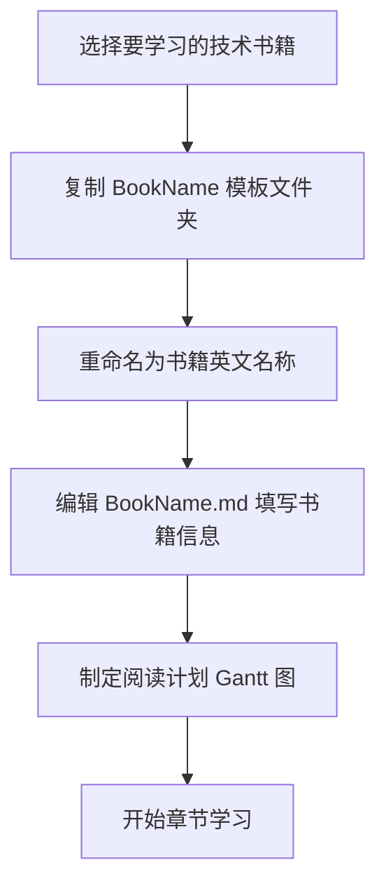
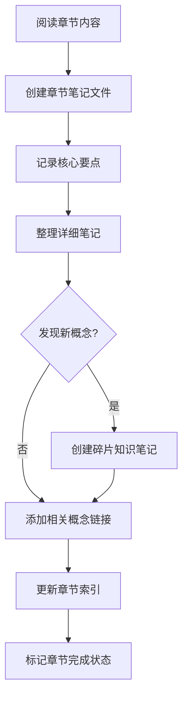
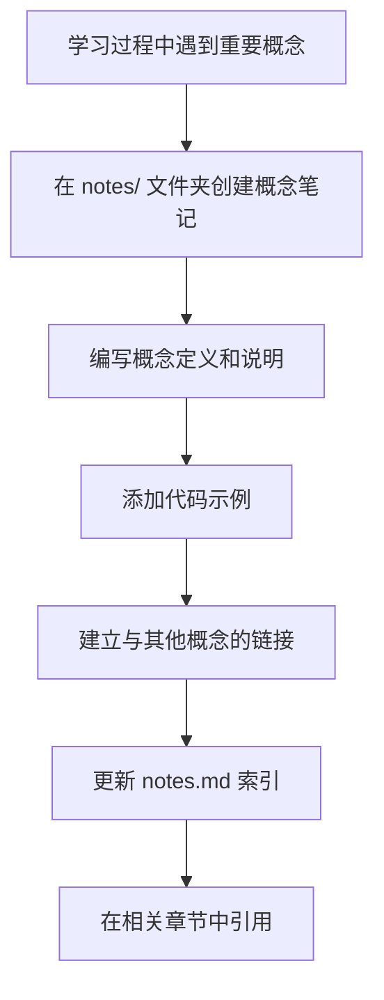
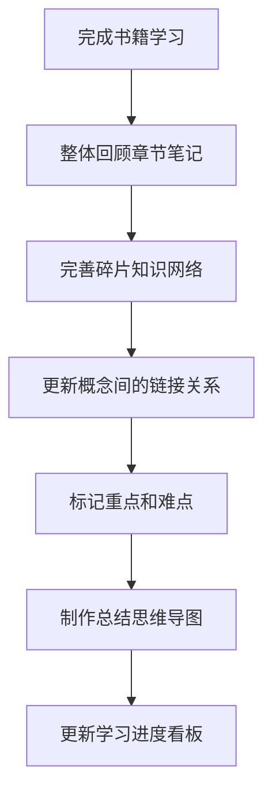

# 📘 技术学习笔记库（Tech Notes）

本项目用于记录我在阅读各类技术书籍、研究文档、分析源码过程中的学习笔记。采用 Markdown 组织，配合 Obsidian 展示，Cursor 编辑，支持多书籍、章节分类、碎片知识聚合等高效知识管理方式。

---

## 🎯 核心理念

- **模块化组织**：每本书独立文件夹，便于维护和查找
- **结构化笔记**：章节笔记 + 碎片知识双重体系
- **链接驱动**：通过内部链接构建知识网络
- **可视化管理**：Gantt 图跟踪阅读进度，Mermaid 图表示概念关系

---

## 📁 项目结构

```bash
tech-notes/
├── README.md                      # 项目导航与工作流说明
├── TecAccumulation.md             # 学习进度看板
├── BookName/                      # 📖 书籍模板文件夹
│   ├── BookName.md                   # 书籍首页（含目录与计划）
│   ├── WritingStandards.md          # 📝 详细书写规范
│   ├── 01-章节标题.md             # 章节笔记
│   ├── notes/                     # 🧩 碎片知识笔记
│   │   └── notes.md               # 碎片索引页
│   ├── .CodeReference/            # 📚 官方代码参考
│   └── .BookReference/            # 📚 电子书籍参考
├── YourBookName1/                 # 实际书籍笔记文件夹
├── YourBookName2/                 # 更多书籍...
└── ...
```

---

## 🚀 工作流程

### 📚 开始新书学习



### 📖 章节学习流程



### 🧩 知识管理流程



### 🔄 复习与整合流程



---

## 🛠️ 使用工具链

- **Obsidian**：主要笔记查看和管理工具
    - 插件：
        - Kanban：看板插件
        - Dataview：数据视图插件
- **Cursor**：Markdown 文件编辑
- **Git**：版本控制和同步
- **Mermaid**：图表和流程图绘制
- **Jupytext**：支持笔记本格式转换

---

## 🚀 快速开始

1. **环境准备**
   ```bash
   # 使用 Obsidian 打开本仓库
   # 安装必要的 Obsidian 插件（Mermaid、内部链接等）
   ```

2. **创建新书籍学习项目**
   ```bash
   # 复制模板文件夹
   cp -r BookName/ "YourBookName"
   
   # 重命名内部文件
   mv "YourBookName/BookName.md" "YourBookName/YourBookName.md"
   ```

3. **开始学习**
   - 参考 [[BookName/WritingStandards]] 了解详细规范
   - 按照工作流程逐步推进
   - 定期更新学习进度

---

## 📊 进度跟踪

通过 [[TecAccumulation]] 看板查看：
- 📚 正在学习的书籍
- 📈 学习进度统计
- 🎯 下一步学习计划
- 📝 待整理的知识点

---

## 🔄 同步与备份

- **本地备份**：定期使用 Git 提交变更
- **云端同步**：推送到 GitHub/GitLab 远程仓库
- **隐私保护**：敏感内容或版权材料请勿上传

---

## 💡 最佳实践

1. **坚持日常更新**：每天至少更新一次笔记
2. **及时建立链接**：发现概念关联时立即创建链接
3. **定期回顾整理**：每周回顾并完善知识网络
4. **标签系统使用**：善用标签进行分类和检索
5. **代码实践结合**：理论学习配合实际编码练习
