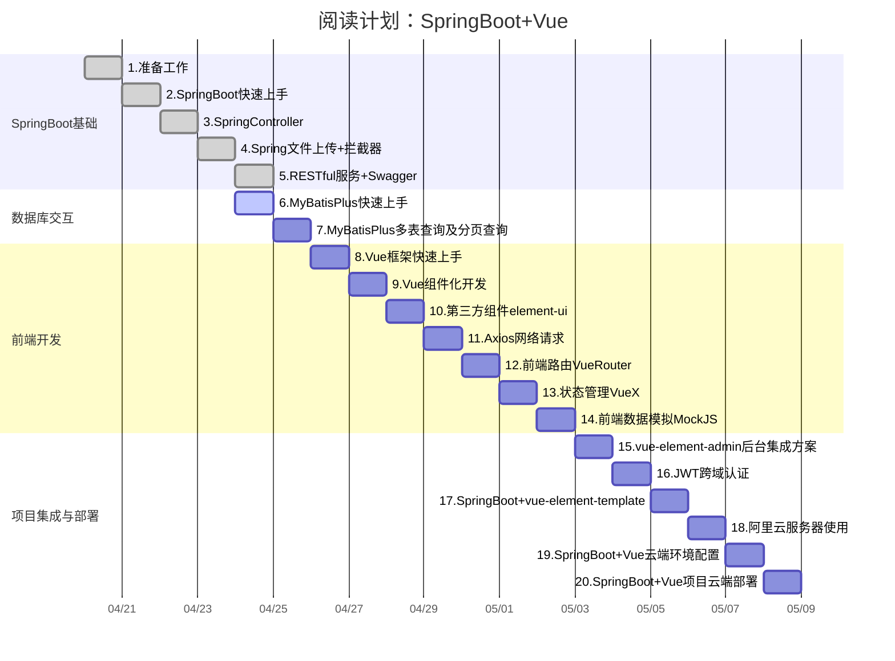

---
jupytext:
  formats: md:markdown,ipynb/SpringBoot+Vue/SpringBoot+Vue.ipynb:notebook
  text_representation:
    extension: .md
    format_name: markdown
    format_version: '1.3'
    jupytext_version: 1.13.8
kernelspec:
  display_name: C++
  language: C++
  name: xcpp
language_info:
  codemirror_mode: text/x-c++src
  file_extension: .cpp
  mimetype: text/x-c++src
  name: c++
  version: '11'
---

# 《SpringBoot+Vue》学习笔记

## 📝 内容概览
这个项目是基于SpringBoot+Vue的，主要用于学习SpringBoot和Vue的开发。
## 📝 阅读计划

## 📋 章节目录
- [01-准备工作](./01-准备工作.md) - 课程介绍及环境准备
- [02-SpringBoot快速上手](./02-SpringBoot快速上手.md) - 学习SpringBoot的基础知识
- [03-SpringController](./03-SpringController.md) - 深入理解Spring Controller的作用
- [04-Spring文件上传+拦截器](./04-Spring文件上传+拦截器.md) - 文件上传及拦截器的实现
- [05-RESTful服务+Swagger](./05-RESTful服务+Swagger.md) - 掌握RESTful API设计与Swagger文档生成
- [06-MyBatisPlus快速上手](./06-MyBatisPlus快速上手.md) - 学习MyBatisPlus的基本用法
- [07-MyBatisPlus多表查询及分页查询](./07-MyBatisPlus多表查询及分页查询.md) - 复杂查询的实现
- [08-Vue框架快速上手](./08-Vue框架快速上手.md) - Vue框架的基础知识
- [09-Vue组件化开发](./09-Vue组件化开发.md) - 组件化开发的最佳实践
- [10-第三方组件element-ui](./10-第三方组件element-ui.md) - 使用Element UI构建美观的界面
- [11-Axios网络请求](./11-Axios网络请求.md) - 使用Axios进行网络请求
- [12-前端路由VueRouter](./12-前端路由VueRouter.md) - VueRouter的使用与配置
- [13-状态管理VueX](./13-状态管理VueX.md) - VueX进行状态管理的实现
- [14-前端数据模拟MockJS](./14-前端数据模拟MockJS.md) - 使用MockJS进行数据模拟
- [15-vue-element-admin后台集成方案](./15-vue-element-admin后台集成方案.md) - 集成方案的实现
- [16-JWT跨域认证](./16-JWT跨域认证.md) - 实现JWT跨域认证
- [17-SpringBoot+vue-element-template](./17-SpringBoot+vue-element-template.md) - 模板的使用与配置
- [18-阿里云服务器使用](./18-阿里云服务器使用.md) - 阿里云服务器的基本操作
- [19-SpringBoot+Vue云端环境配置](./19-SpringBoot+Vue云端环境配置.md) - 云端环境的配置
- [20-SpringBoot+Vue项目云端部署](./20-SpringBoot+Vue项目云端部署.md) - 项目的云端部署流程

## 🔍 重点内容索引
- [notes/概念A](./notes/概念A.md)
- [notes/概念B](./notes/概念B.md)

## 📚 参考资源
- 官方网站：[链接](URL)
- 配套代码：[[.CodeReference/README]]
